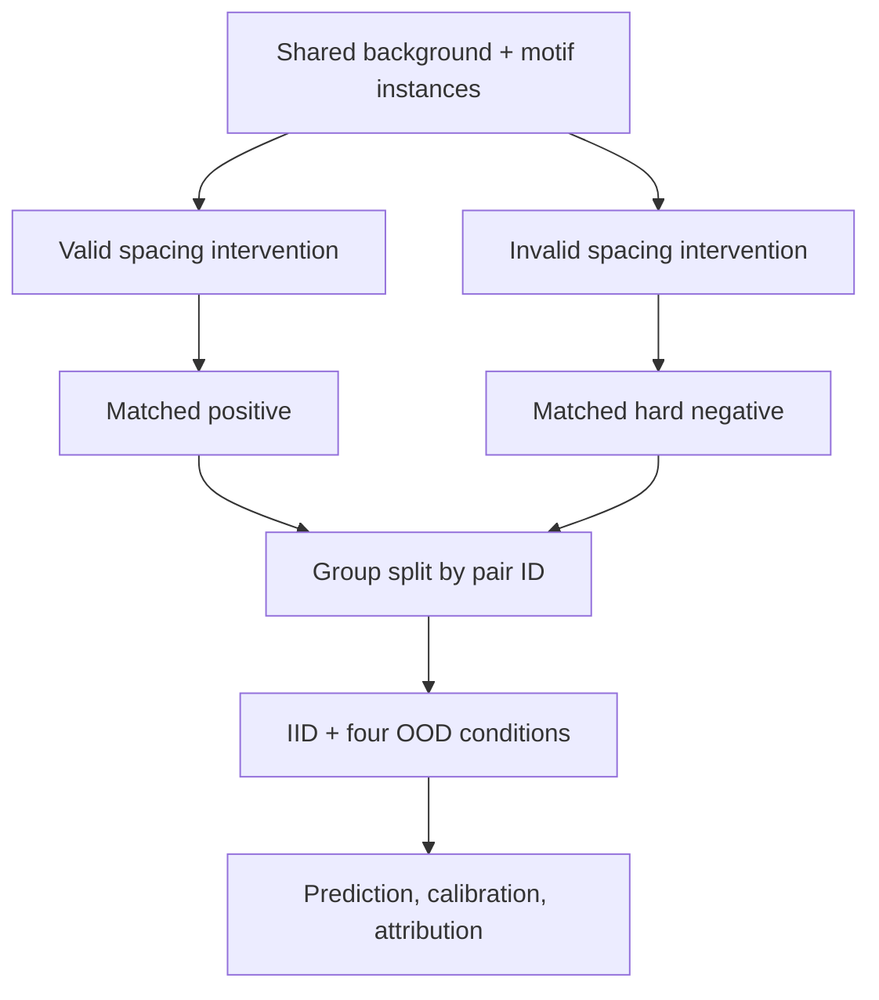

# CisGrammarShift

**A counterfactual benchmark for testing whether sequence models learn transcription-factor syntax or motif-presence shortcuts.**

[](https://github.com/Joe0908/DL-on-DNA-seq/actions/workflows/ci.yml)
[](https://www.python.org/)
[](LICENSE)

## Research question

When a neural network predicts cis-regulatory activity, has it learned the spatial relationship between motifs, or only that the motifs are present?

The original project inserted a CTCF motif into uniform random DNA and compared four neural-network architectures. That is a useful learning exercise, but it cannot establish real TF binding, model superiority, or cis-regulatory grammar. This upgrade turns the idea into a falsifiable benchmark with:

- matched positive/negative pairs containing the **same sampled motif instances** on the **same background**;
- a controlled intervention on spacing, while motif identity and strength are held fixed;
- pair-level train/validation/test separation;
- IID and pre-specified distribution shifts in spacing, orientation, GC content, and motif strength;
- multiple random seeds, uncertainty across runs, calibration, pairwise ranking, and attribution-localisation metrics;
- a deliberately weak PWM-presence baseline that should fail when motif presence is not predictive.

The default case study uses CIS-BP POU5F1 (`M05705_3.00`) and NANOG (`M05219_3.00`) probability matrices. Its periodic rule is a **synthetic ground truth**, inspired by reported Nanog-associated helical periodicity; it is not presented as evidence that this exact POU5F1–NANOG rule operates in vivo.

## Study design



For the default periodic rule, a gap is positive when its phase modulo 10 is one of `{0, 1, 9}`. Every counterfactual pair has one valid and one invalid gap. A model therefore cannot solve the task by merely detecting POU5F1 and NANOG.

| Evaluation condition | What changes from training | Question |
|---|---|---|
| `iid` | Nothing | Can the model learn the task at all? |
| `gap_ood` | Unseen gap range | Does the learned rule extrapolate? |
| `orientation_ood` | Reverse-complement motifs appear | Is the rule strand-robust? |
| `gc_ood` | Background GC rises | Is the prediction robust to sequence composition? |
| `strength_ood` | Motifs are sampled at higher temperature | Does the model tolerate weaker motif instances? |

## Models and measurements

The benchmark compares:

- `pwm_presence`: non-neural motif-presence control;
- `local_cnn`: limited-receptive-field motif detector;
- `dilated_cnn`: long-range residual convolutional model;
- `transformer`: positional self-attention model.

Primary endpoints are AUROC and matched-pair accuracy. Secondary endpoints include AUPRC, balanced accuracy, Matthews correlation coefficient, Brier score, expected calibration error, counterfactual probability delta, and gradient-times-input mass within the known implanted motif positions.

Thresholds are selected on validation data only. Test examples are generated independently, and each matched pair remains within one split.

## Quick start

```bash
python -m venv .venv
source .venv/bin/activate
python -m pip install -e ".[dev]"

# Fast end-to-end check
cisgrammar run --config configs/quick.yaml --output results/quick

# Pre-registered multi-seed benchmark
cisgrammar run --config configs/research.yaml --output results/research

pytest
```

The run directory contains per-seed metrics, aggregated summaries, per-example predictions, standard figures, a frozen configuration, software versions, trained state dictionaries, and attribution-localisation measurements. Generated results and checkpoints are intentionally ignored by Git.

## Repository layout

```text
configs/                 Versioned experiment definitions
docs/                    Audit, protocol, data specification, real-data plan
src/cisgrammar/          Generator, models, baselines, metrics, training, CLI
tests/                   Invariants and smoke tests
legacy/original/         Preserved student-stage code and figures
```

## Claims ladder

This repository currently supports a **controlled synthetic benchmark**, not a biological discovery claim.

1. A successful run may show that an architecture recovers the programmed grammar.
2. Robust OOD and attribution results may show that it learned the intended synthetic rule.
3. Only validation on experimental data can support a claim about endogenous TF binding.
4. A mechanistic claim requires perturbational evidence, not prediction alone.

The planned real-data stage uses held-out chromosomes from pluripotency-factor ChIP-nexus/ChIP-seq data and pre-specified motif-pair analyses. It is documented in [`docs/real_data_plan.md`](docs/real_data_plan.md); no result is claimed until the accessioned data and analysis are added.

## Why this direction

BPNet showed that base-resolution profile models can recover soft motif syntax and reported roughly 10-bp Nanog-associated periodicity; it also showed that a single convolutional layer lacks the receptive field needed to capture this pattern. CisGrammarShift uses that observation as a positive-control inspiration, then asks a different methods question: **which apparent grammar findings survive counterfactual matching and distribution shift?**

## References

- Avsec Ž, et al. [Base-resolution models of transcription-factor binding reveal soft motif syntax](https://doi.org/10.1038/s41588-021-00782-6). *Nature Genetics* (2021).
- Weirauch MT, et al. [Determination and inference of eukaryotic transcription factor sequence specificity](https://doi.org/10.1016/j.cell.2014.08.009). *Cell* (2014). Motif metadata: [CIS-BP](https://cisbp.ccbr.utoronto.ca/).
- Ovek Baydar D, et al. [JASPAR 2026: expansion of transcription factor binding profiles and integration of deep learning models](https://academic.oup.com/nar/article/54/D1/D184/8343514). *Nucleic Acids Research* (2026).

## Citation

If you use this benchmark, cite the repository metadata in [`CITATION.cff`](CITATION.cff). Until experimental validation is complete, describe it as a controlled synthetic benchmark rather than a TF-binding predictor.
